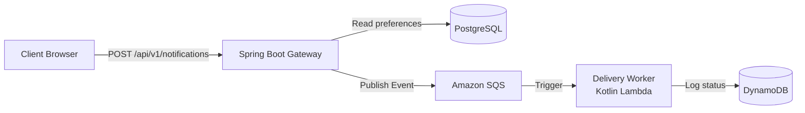
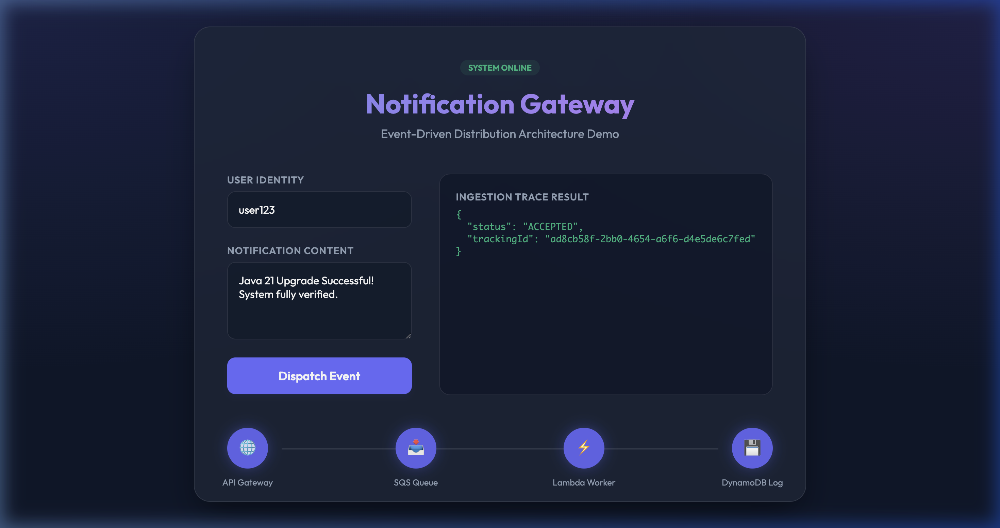
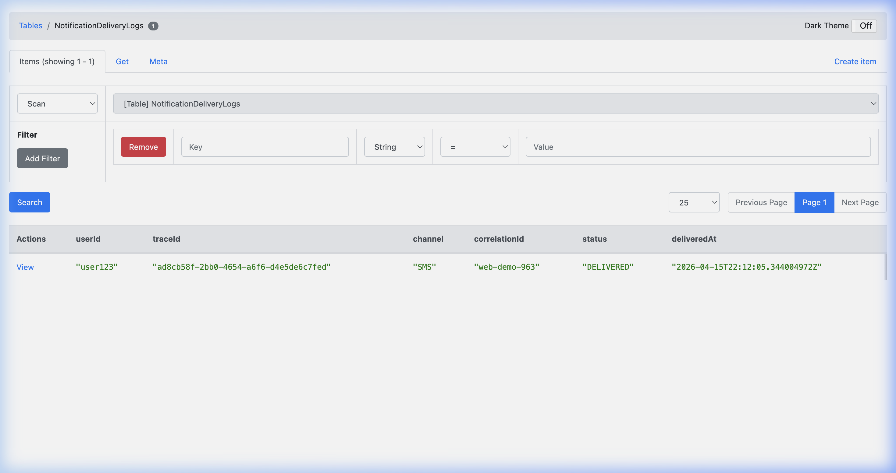

# Distributed Notification System

An event-driven notification system showcasing production-grade architecture built entirely with modern, cloud-native tooling. Every component — from the reactive HTTP layer to the serverless worker to the AWS infrastructure — follows industry best practices.

## Architecture



## Tech Stack

| Layer | Technology |
|---|---|
| **API Gateway** | Kotlin + Spring Boot (WebFlux + Coroutines) |
| **Message Queue** | Amazon SQS (via LocalStack 3.4) |
| **Delivery Worker** | AWS Lambda — pure Kotlin (JVM 21) |
| **Relational DB** | PostgreSQL via R2DBC (non-blocking) |
| **NoSQL DB** | Amazon DynamoDB — delivery logs |
| **Infrastructure** | Terraform (IaC) via Docker |
| **Local AWS** | LocalStack — full local AWS sandbox |
| **Testing** | JUnit 5, MockK, Testcontainers |

## Senior-Level Implementation Highlights

- **Reactive & Non-Blocking**: Leverages Kotlin Coroutines with Spring WebFlux and R2DBC to enable high-concurrency event ingestion with minimal memory footprint.
- **Pure Kotlin Lambda**: The delivery worker is a lightweight Kotlin function (compiled to JVM 21) using the official AWS Kotlin SDK, optimized for low cold-start times.
- **Polyglot Persistence**: Strategic use of PostgreSQL for ACID-compliant user preferences and DynamoDB for high-velocity, append-only delivery auditing.
- **Infrastructure as Code (IaC)**: The entire local environment (SQS, Lambda, DynamoDB, IAM) is provisioned via Terraform, ensuring the local development experience mirrors production perfectly.
- **Distributed Tracing**: Implements consistent `correlationId` and `traceId` propagation across service boundaries for end-to-end observability.

---

## Local Setup & Demo

### Prerequisites
- [Docker Desktop](https://www.docker.com/products/docker-desktop/) running
- Java 21+ (for running the Gateway)

### Step 1 — Start the Infrastructure
```bash
docker compose up -d
```
*This starts Postgres, LocalStack, and runs the Terraform provisioner automatically.*

### Step 2 — Start the Gateway
```bash
cd notification-gateway
./gradlew bootRun
```

### Step 3 — Open the Dashboard
Open **[http://localhost:8081](http://localhost:8081)** to use the premium glassmorphic dashboard.



---

## Observability & Audit Logs

Once a notification is dispatched, you can verify its delivery status in real-time within the DynamoDB audit log.


*Audit logs appearing with unique Trace IDs for end-to-end tracking.*

## E2E Verification Script

For automated testing, run:
```bash
bash verify.sh
```

## Manual Resource Inspection
- **DynamoDB Admin**: [http://localhost:8001](http://localhost:8001)
- **pgAdmin**: [http://localhost:5050](http://localhost:5050)
